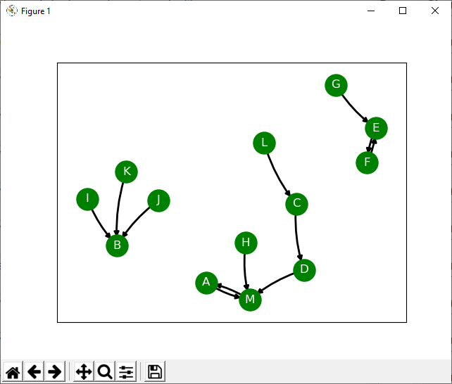
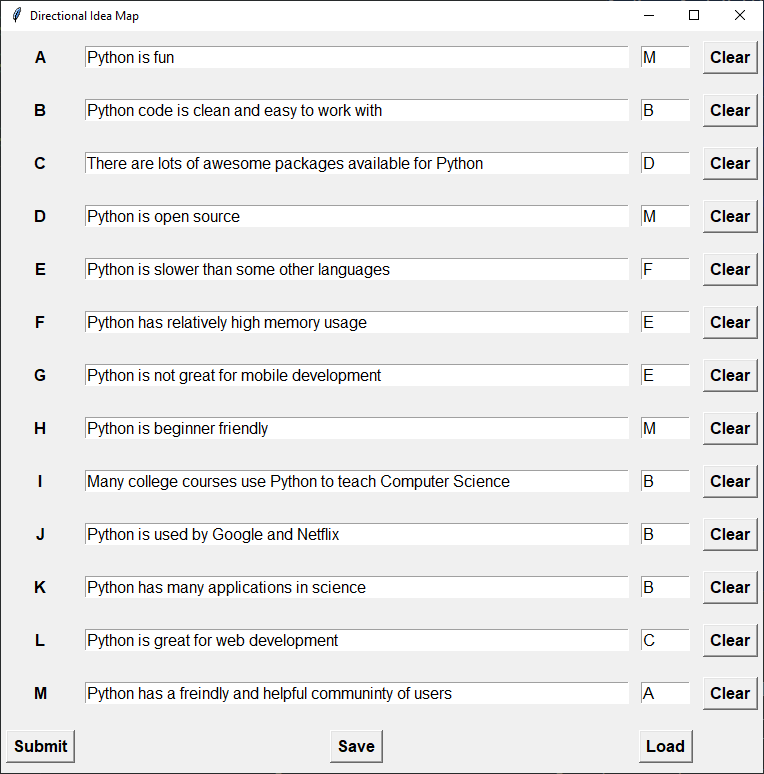

# Directional Idea Maps with Python

This is a metacognitive tool written in Python for exploring the relationship between elements in a situation. It is inspired by [Edward de Bono's flowscapes][1].

Usage:

- List the elements present in the situation you want to explore
- Choose an element each other element flows most naturally towards
- Hit submit and see a visual representation of the relationship between the elements
- Interpret at will
- You can save/load previous sessions if required.

[1]: http://tools-for-thought.com/2008/03/18/examining-trains-of-thought-with-flowscapes/

